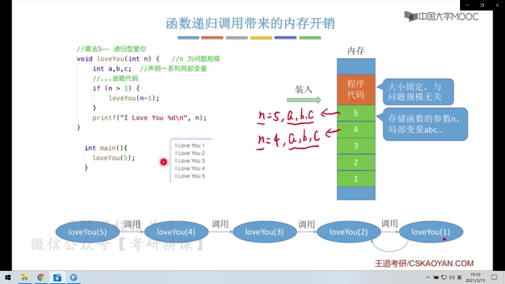

# 算法的效率度量

## 1 时间复杂度

### 1.1 事后统计

* 缺点
  1. 和机器性能有关
  2. 和编程语言有关
  3. 和编译程序产生的机器指令质量有关系
  4. 有些算法不能事后统计，如：导弹控制算法

### 1.2 事前统计——时间复杂度

**事前预估**算法**时间开销T\(n\)**和**问题规模n**的关系（T表示“time”）

#### 1.2.1 算法的时间复杂度


#### 1.2.2 一些常用的结论

1. **常对幂指阶**
2. 顺序执行的代码是常数，可以忽略
3. 只需要关注循环里的一条语句执行次数和n的关系即可
4. 多层循环，关注最内层

#### 1.2.3 for

可以参照[C语言的for循环](https://bxg.gitbook.io/language/c/for)

#### 1.2.4 if

含有`if` 的算法，会出现：

* 最好时间复杂度
* 平均时间复杂度
* 最坏时间复杂度

## 2 空间复杂度

### 2.1 内存需求

需要消耗内存的内容

> 如果一个代码的大小是固定的，那么我们称其是原地工作的。

1. 程序代码（编译后的机器指令）：大小固定，与问题规模无关
2. 数据：存放参数、变量、字符串等

如果内部存储是发生变化的，我们就要计算内部需要消耗多大的内存。而这个消耗，通常和程序代码本身需要消耗的存储无关。

### 2.2 一些空间复杂度的案例

#### 2.2.1 数组

下面的代码的空间复杂度为O\(n\)

```cpp
void test(int n){
    int a[n];
    // 其他一些代码
}
```

下面代码的空间复杂度为O\(n^2\)

```cpp
void test(int n){
    int a[n][n];
    int b[n];
    // 其他一些代码
}
```

#### 2.2.2 递归



空间复杂度 = 递归调用的深度


## 递归

递归也有3个元素，分别是：

1. 起始数值
2. 终止条件
3. 对起始数值的操作

### 1. 起始数值

起始数值通常是一个递归函数传入的参数的数值，例如：

```c
void digui(int n){
    // ...
}
int main(){
    digui(10)
    return 0;
}
```

注意到，在上面的代码中，传入的参数`n` 就是初始数值。

### 2. 终止条件

我们通常需要一个判断，来决定什么时候递归结束，这是递归重要的一环。

```c
void digui(int n){ // 初始值
    if( n > 0){ // 终止条件
        digui( n - 1 ) // 对起始数值的操作
    }else{
        // ...
    }
}
int main(){
    digui(10); // 会调用10次。
    return 0;
}
```

### 3. 对起始数值的操作

仅仅有终止条件的话，也只是每轮进行判断，不改变初始值，判断就无意义。



